# Hello, welcome MeilCli's Profile

## Metrics

 
  
## Languages and Tools:

              

## Other

**How to reach me?**  
I will respond at twitter, [@penguin_sharp](https://twitter.com/penguin_sharp)

## My Repositories
### GitHub Action for develop GitHub Action 

)

 

### GitHub Action for about PullRequest or Issue

 

### GitHub Action of slack

 

### GitHub Action for improve workflow

 

### GitHub Action of check updates

 

### GitHub Action for statistics

 

### Other

 

