# Hello, welcome MeilCli's Profile

 
  
## Languages and Tools

              

## Repositories
### GitHub Action for develop GitHub Action 

<a href="https://github.com/MeilCli/action-template">
  <picture>
    <source media="(prefers-color-scheme: dark)" srcset="https://github-readme-stats.vercel.app/api/pin/?username=MeilCli&repo=action-template&theme=react">
    <source media="(prefers-color-scheme: light)" srcset="https://github-readme-stats.vercel.app/api/pin/?username=MeilCli&repo=action-template">
    
  </picture>
</a>
<a href="https://github.com/MeilCli/bump-release-action">
  <picture>
    <source media="(prefers-color-scheme: dark)" srcset="https://github-readme-stats.vercel.app/api/pin/?username=MeilCli&repo=bump-release-action&theme=react">
    <source media="(prefers-color-scheme: light)" srcset="https://github-readme-stats.vercel.app/api/pin/?username=MeilCli&repo=bump-release-action">
    
  </picture>
</a>
<a href="https://github.com/MeilCli/test-command-action">
  <picture>
    <source media="(prefers-color-scheme: dark)" srcset="https://github-readme-stats.vercel.app/api/pin/?username=MeilCli&repo=test-command-action&theme=react">
    <source media="(prefers-color-scheme: light)" srcset="https://github-readme-stats.vercel.app/api/pin/?username=MeilCli&repo=test-command-action">
    
  </picture>
</a>
 

### GitHub Action for about PullRequest or Issue
<a href="https://github.com/MeilCli/danger-action">
  <picture>
    <source media="(prefers-color-scheme: dark)" srcset="https://github-readme-stats.vercel.app/api/pin/?username=MeilCli&repo=danger-action&theme=react">
    <source media="(prefers-color-scheme: light)" srcset="https://github-readme-stats.vercel.app/api/pin/?username=MeilCli&repo=danger-action">
    
  </picture>
</a>
<a href="https://github.com/MeilCli/hidable-comment-action">
  <picture>
    <source media="(prefers-color-scheme: dark)" srcset="https://github-readme-stats.vercel.app/api/pin/?username=MeilCli&repo=hidable-comment-action&theme=react">
    <source media="(prefers-color-scheme: light)" srcset="https://github-readme-stats.vercel.app/api/pin/?username=MeilCli&repo=hidable-comment-action">
    
  </picture>
</a>
<a href="https://github.com/MeilCli/common-lint-reporter">
  <picture>
    <source media="(prefers-color-scheme: dark)" srcset="https://github-readme-stats.vercel.app/api/pin/?username=MeilCli&repo=common-lint-reporter&theme=react">
    <source media="(prefers-color-scheme: light)" srcset="https://github-readme-stats.vercel.app/api/pin/?username=MeilCli&repo=common-lint-reporter">
    
  </picture>
</a>
 

### GitHub Action of slack
<a href="https://github.com/MeilCli/slack-upload-file">
  <picture>
    <source media="(prefers-color-scheme: dark)" srcset="https://github-readme-stats.vercel.app/api/pin/?username=MeilCli&repo=slack-upload-file&theme=react">
    <source media="(prefers-color-scheme: light)" srcset="https://github-readme-stats.vercel.app/api/pin/?username=MeilCli&repo=slack-upload-file">
    
  </picture>
</a>
 

### GitHub Action for improve workflow
<a href="https://github.com/MeilCli/regex-match">
  <picture>
    <source media="(prefers-color-scheme: dark)" srcset="https://github-readme-stats.vercel.app/api/pin/?username=MeilCli&repo=regex-match&theme=react">
    <source media="(prefers-color-scheme: light)" srcset="https://github-readme-stats.vercel.app/api/pin/?username=MeilCli&repo=regex-match">
    
  </picture>
</a>
<a href="https://github.com/MeilCli/setup-crystal-action">
  <picture>
    <source media="(prefers-color-scheme: dark)" srcset="https://github-readme-stats.vercel.app/api/pin/?username=MeilCli&repo=setup-crystal-action&theme=react">
    <source media="(prefers-color-scheme: light)" srcset="https://github-readme-stats.vercel.app/api/pin/?username=MeilCli&repo=setup-crystal-action">
    
  </picture>
</a>
 

### GitHub Action of check updates
<a href="https://github.com/MeilCli/npm-update-check-action">
  <picture>
    <source media="(prefers-color-scheme: dark)" srcset="https://github-readme-stats.vercel.app/api/pin/?username=MeilCli&repo=npm-update-check-action&theme=react">
    <source media="(prefers-color-scheme: light)" srcset="https://github-readme-stats.vercel.app/api/pin/?username=MeilCli&repo=npm-update-check-action">
    
  </picture>
</a>
<a href="https://github.com/MeilCli/nuget-update-check-action">
  <picture>
    <source media="(prefers-color-scheme: dark)" srcset="https://github-readme-stats.vercel.app/api/pin/?username=MeilCli&repo=nuget-update-check-action&theme=react">
    <source media="(prefers-color-scheme: light)" srcset="https://github-readme-stats.vercel.app/api/pin/?username=MeilCli&repo=nuget-update-check-action">
    
  </picture>
</a>
<a href="https://github.com/MeilCli/gradle-update-check-action">
  <picture>
    <source media="(prefers-color-scheme: dark)" srcset="https://github-readme-stats.vercel.app/api/pin/?username=MeilCli&repo=gradle-update-check-action&theme=react">
    <source media="(prefers-color-scheme: light)" srcset="https://github-readme-stats.vercel.app/api/pin/?username=MeilCli&repo=gradle-update-check-action">
    
  </picture>
</a>
<a href="https://github.com/MeilCli/swiftpm-update-check-action">
  <picture>
    <source media="(prefers-color-scheme: dark)" srcset="https://github-readme-stats.vercel.app/api/pin/?username=MeilCli&repo=swiftpm-update-check-action&theme=react">
    <source media="(prefers-color-scheme: light)" srcset="https://github-readme-stats.vercel.app/api/pin/?username=MeilCli&repo=swiftpm-update-check-action">
    
  </picture>
</a>
<a href="https://github.com/MeilCli/carthage-update-check-action">
  <picture>
    <source media="(prefers-color-scheme: dark)" srcset="https://github-readme-stats.vercel.app/api/pin/?username=MeilCli&repo=carthage-update-check-action&theme=react">
    <source media="(prefers-color-scheme: light)" srcset="https://github-readme-stats.vercel.app/api/pin/?username=MeilCli&repo=carthage-update-check-action">
    
  </picture>
</a>
<a href="https://github.com/MeilCli/cocoapods-update-check-action">
  <picture>
    <source media="(prefers-color-scheme: dark)" srcset="https://github-readme-stats.vercel.app/api/pin/?username=MeilCli&repo=cocoapods-update-check-action&theme=react">
    <source media="(prefers-color-scheme: light)" srcset="https://github-readme-stats.vercel.app/api/pin/?username=MeilCli&repo=cocoapods-update-check-action">
    
  </picture>
</a>
 

### GitHub Action for statistics
<a href="https://github.com/MeilCli/detekt-statistics">
  <picture>
    <source media="(prefers-color-scheme: dark)" srcset="https://github-readme-stats.vercel.app/api/pin/?username=MeilCli&repo=detekt-statistics&theme=react">
    <source media="(prefers-color-scheme: light)" srcset="https://github-readme-stats.vercel.app/api/pin/?username=MeilCli&repo=detekt-statistics">
    
  </picture>
</a>
<a href="https://github.com/MeilCli/android-lint-statistics">
  <picture>
    <source media="(prefers-color-scheme: dark)" srcset="https://github-readme-stats.vercel.app/api/pin/?username=MeilCli&repo=android-lint-statistics&theme=react">
    <source media="(prefers-color-scheme: light)" srcset="https://github-readme-stats.vercel.app/api/pin/?username=MeilCli&repo=android-lint-statistics">
    
  </picture>
</a>
 

### Other
<a href="https://github.com/MeilCli/Librarian">
  <picture>
    <source media="(prefers-color-scheme: dark)" srcset="https://github-readme-stats.vercel.app/api/pin/?username=MeilCli&repo=Librarian&theme=react">
    <source media="(prefers-color-scheme: light)" srcset="https://github-readme-stats.vercel.app/api/pin/?username=MeilCli&repo=Librarian">
    
  </picture>
</a>
<a href="https://github.com/MeilCli/notion-db-notification">
  <picture>
    <source media="(prefers-color-scheme: dark)" srcset="https://github-readme-stats.vercel.app/api/pin/?username=MeilCli&repo=notion-db-notification&theme=react">
    <source media="(prefers-color-scheme: light)" srcset="https://github-readme-stats.vercel.app/api/pin/?username=MeilCli&repo=notion-db-notification">
    
  </picture>
</a>
 

